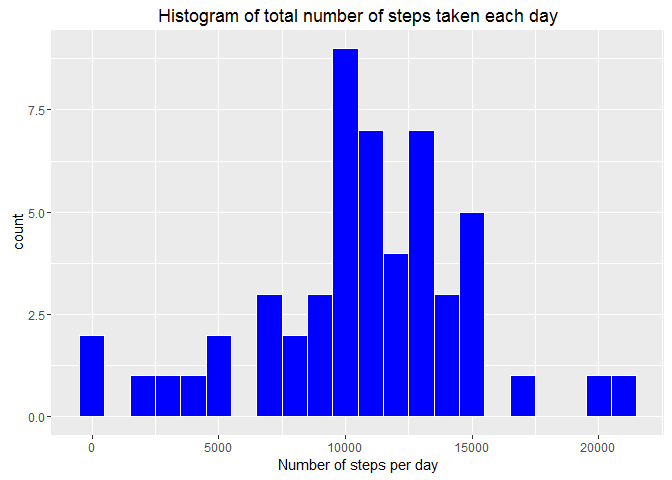
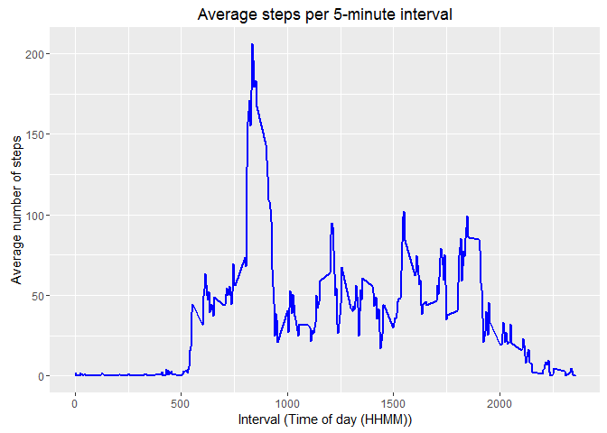
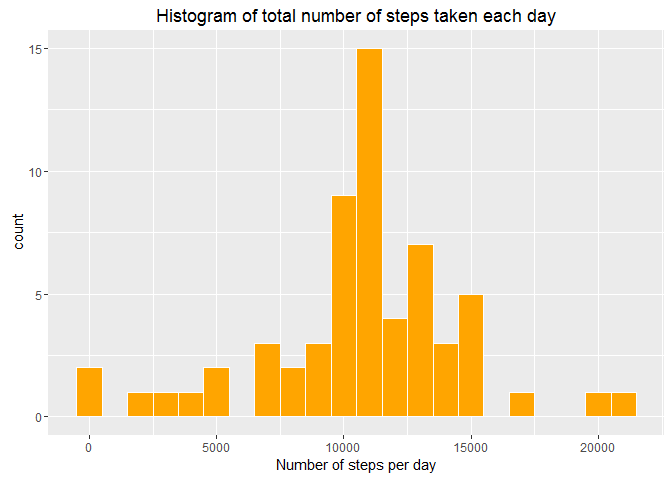
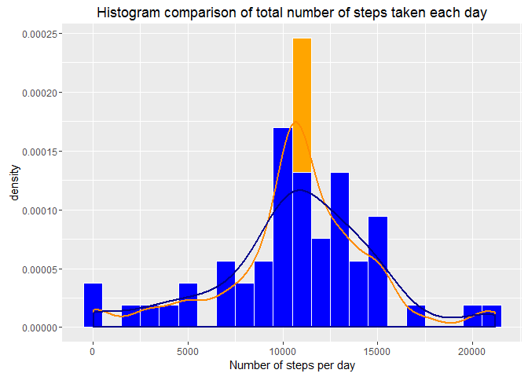
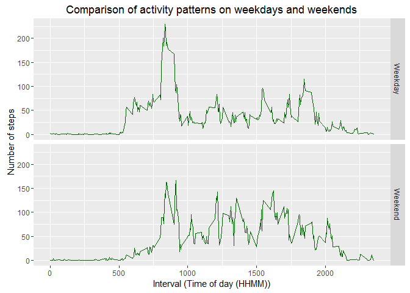

# Reproducible Research: Peer Assessment 1
NicZ8  
6 May 2016  
# Report on exploration of data from a personal activity monitoring device

## Loading and preprocessing the data

Prior to my analysis, I downloaded the file ```activity.zip``` and extracted the file ```activity.csv``` to my working directory.
A description of the data can be found in the ```README.md``` document.

### Loading the data

I loaded the dataset and saved it into the variable ```act```.


```r
act <- read.csv("activity.csv")
```

### Preprocessing

To aid further analysis I changed the ```date``` variable to the Date class.


```r
act$date <- as.Date(act$date)
```

With the ```str``` function I revealed some details about the dataset.


```r
str(act)
```

```
## 'data.frame':	17568 obs. of  3 variables:
##  $ steps   : int  NA NA NA NA NA NA NA NA NA NA ...
##  $ date    : Date, format: "2012-10-01" "2012-10-01" ...
##  $ interval: int  0 5 10 15 20 25 30 35 40 45 ...
```

A random sample of rows from the data set looks like this:


```r
act[sample(1:nrow(act), 6), ]
```

```
##      steps       date interval
## 5550     0 2012-10-20      625
## 3590     0 2012-10-13     1105
## 6491    13 2012-10-23     1250
## 3604   429 2012-10-13     1215
## 9822    NA 2012-11-04      225
## 132     NA 2012-10-01     1055
```

For further analysis and for creation of plots I loaded the ```dplyr``` package and the ```ggplot2``` package.


```r
library(dplyr)
library(ggplot2)
```

## What is the mean total number of steps taken per day?

### Total steps per day

First, I calculated the total number of steps taken per day and saved them in the data frame ```spd```. For this calculation I ignored missing values.


```r
spd <- aggregate(steps ~ date, act, sum, na.rm = TRUE)
```

The first few rows of the data frame ```spd``` look like this:


```r
head(spd)
```

```
##         date steps
## 1 2012-10-02   126
## 2 2012-10-03 11352
## 3 2012-10-04 12116
## 4 2012-10-05 13294
## 5 2012-10-06 15420
## 6 2012-10-07 11015
```

### Histogram of steps per day

The distribution of the total number of steps taken each day is shown in the histogram below. 


```r
ggplot(spd, aes(steps)) +
        geom_histogram(binwidth = 1000, color = "white", fill = "blue") +
        ggtitle("Histogram of total number of steps taken each day") +
        xlab("Number of steps per day") 
```



### Mean and median values of steps per day

Then I calculated the mean and median of the total number of steps taken per day as follows.


```r
mean(spd$steps)
```

```
## [1] 10766.19
```

```r
median(spd$steps)
```

```
## [1] 10765
```

The mean is **10766.19** steps per day and the median is **10765** steps per day.

## What is the average daily activity pattern?

### Average number of steps per interval

First, I calculated the average number of steps taken per interval and saved the results in the data frame ```spi```.


```r
spi <- aggregate(steps ~ interval, act, mean)
```

I confirmed that the results of this calculation make sense.


```r
str(spi)
```

```
## 'data.frame':	288 obs. of  2 variables:
##  $ interval: int  0 5 10 15 20 25 30 35 40 45 ...
##  $ steps   : num  1.717 0.3396 0.1321 0.1509 0.0755 ...
```

The resulting data frame ```spi``` has 288 observations corresponding to the 288 5-minute intervals in a 24 hour day.
The interval represents a time of day (HHMM), with intervals ranging from 0 to 2355.  

### Time series plot of daily activity pattern

To show the average daily activity pattern, I made a time series plot (line plot) of the 5-minute interval (x-axis) and the average number of steps taken, averaged across all days (y-axis).


```r
ggplot(spi, aes(interval, steps)) +
        geom_line(color = "blue", size = 1) +
        ggtitle("Average steps per 5-minute interval") +
        xlab("Interval (Time of day (HHMM))") +
        ylab("Average number of steps")
```



### Interval with most steps

Then I determined the 5-minute interval which, on average across all the days in the dataset, contains the maximum number of steps.


```r
spi[spi$steps == max(spi$steps), ]
```

```
##     interval    steps
## 104      835 206.1698
```

Interval **835**, which means the 5-minute interval starting at **8:35am**, contains the most steps (i.e. approximately 206 steps on average).

## Imputing missing values

### Identifying missing values

First, I calculated the total number of missing values in the dataset (i.e. the total number of rows with NAs).
I assumed that any missing values would be in the ```steps``` variable, so I checked this variable first.


```r
sum(is.na(act$steps))
```

```
## [1] 2304
```

Then I compared this figure with missing values in the whole data frame.


```r
sum(is.na(act))
```

```
## [1] 2304
```

This confirms that only the ```steps``` variable contains missing values.
The dataset has **2304** rows with missing values.

### Strategy for filling the missing values

I needed to devise a strategy for filling in all of the missing values in the dataset. The strategy did not need to be sophisticated. 
I chose to replace the missing values with the mean value for the same 5-minute interval across all other days.
The previously created data frame ```spi``` contains the mean number of steps per interval and can be used for replacing the missing values.

### New dataset with the missing data filled in

I needed to create a new data set that is equal to the original dataset but with the missing data filled in.

First, I included the replacement values from the ```spi``` data frame in the ```act``` dataset by merging the two data frames and assigning the result to a new data frame ```act1```.


```r
act1 <- merge(spi, act, by = "interval")
```

This is what the first few rows of ```act1``` look like:


```r
head(act1)
```

```
##   interval  steps.x steps.y       date
## 1        0 1.716981      NA 2012-10-01
## 2        0 1.716981       0 2012-11-23
## 3        0 1.716981       0 2012-10-28
## 4        0 1.716981       0 2012-11-06
## 5        0 1.716981       0 2012-11-24
## 6        0 1.716981       0 2012-11-15
```

After merging, the variable ```steps.x``` contains values for the mean steps per interval from ```spi``` and ```steps.y``` the original values including NAs.

Then I performed the following computations to create the new data set ```act.mod```:   

  - add column ```steps``` replacing only the missing values and keeping all others  from the original data  
  - select only the relevant columns equivalent to the originial data set  
  - order rows by data and interval equivalent to the original data set.  


```r
act.mod <- act1 %>% 
        mutate(steps = ifelse(is.na(steps.y), steps.x, steps.y)) %>%
        select(steps, date, interval) %>%
        arrange(date, interval)
```

I confirmed that the new dataset looks equivalent the original one.


```r
str(act.mod)
```

```
## 'data.frame':	17568 obs. of  3 variables:
##  $ steps   : num  1.717 0.3396 0.1321 0.1509 0.0755 ...
##  $ date    : Date, format: "2012-10-01" "2012-10-01" ...
##  $ interval: int  0 5 10 15 20 25 30 35 40 45 ...
```

I also confirmed that the ```steps``` variable contains no missing values.


```r
sum(is.na(act.mod$steps))
```

```
## [1] 0
```

### Histogram of total number of steps (with imputed values)

Similar to before, I calculated the total number of steps taken per day, now with the imputed values included. This time I saved them in the data frame ```spd.mod```.


```r
spd.mod <- aggregate(steps ~ date, act.mod, sum)
```

The distribution of the total number of steps taken each day (including imputed values is shown in the histogram below. 


```r
ggplot(spd.mod, aes(steps)) +
        geom_histogram(binwidth = 1000, color = "white", fill = "orange") +
        ggtitle("Histogram of total number of steps taken each day") +
        xlab("Number of steps per day")
```



### Mean and median values of steps per day (with imputed values)

I calculated the mean and median of the total number of steps taken per day using the modified data with imputed values.


```r
mean(spd.mod$steps)
```

```
## [1] 10766.19
```

```r
median(spd.mod$steps)
```

```
## [1] 10766.19
```

### Comparison to original data

As can be seen from the calculated results, the mean of daily steps remained unchanged at **10766.19**, i.e. replacing missing values with imputed values had no impact on the mean number of steps per day. This was expected as I used the mean values in my strategy for filling the missing values.    

The median of daily steps increased slightly from **10765** to **10766.19**. 

### Impact of imputing missing data on the estimates of the total daily number of steps

To demonstrate the impact of imputing missing values, I plotted an overlay of the distribution of both, original data and modified data with imputed values, and added density curves for both.


```r
ggplot(spd.mod, aes(steps)) +
        geom_histogram(aes(y = ..density..), binwidth = 1000, color = "white", fill = "orange") +
        geom_histogram(aes(y = ..density..), data = spd, binwidth = 1000, color = "white", fill = "blue") +
        geom_density(color = "dark orange", size = 1) +
        geom_density(data = spd, color = "dark blue", size = 1) +
        ggtitle("Histogram comparison of total number of steps taken each day") +
        xlab("Number of steps per day") 
```



The graph shows that by imputing missing values I created a spike around the mean value. The distribution changed with a bias towards the mean. It can be assumed that the real data would have been more evenly spread.

This change in the distribution can also be seen when comparing the summaries with quantiles for both data sets.


```r
summary(spd$steps)
```

```
##    Min. 1st Qu.  Median    Mean 3rd Qu.    Max. 
##      41    8841   10760   10770   13290   21190
```

```r
summary(spd.mod$steps)
```

```
##    Min. 1st Qu.  Median    Mean 3rd Qu.    Max. 
##      41    9819   10770   10770   12810   21190
```

It appears that the strategy chosen for imputing values has a big impact on the estimates of daily steps. Choosing the mean may not be the best strategy in this case.

## Are there differences in activity patterns between weekdays and weekends?

For this part I used the dataset ```act.mod``` with the filled-in missing values and called it a new name ```act.new```.


```r
act.new <- act.mod
```

### Factor variable to separate weekdays or weekend days

I needed to create a new factor variable in the dataset with two levels, *weekday* and *weekend*, indicating whether a given date is a weekday or weekend day.

First, I added a column to the dataset containing the day of the week.


```r
act.new$day <- weekdays(act.mod$date)
```

Then, I created the required factor variable ```day.type``` in another new column.


```r
act.new$day.type <- as.factor(ifelse(act.new$day %in% c("Saturday", "Sunday"), "Weekend", "Weekday"))
```

The dataset then looks like this:


```r
str(act.new)
```

```
## 'data.frame':	17568 obs. of  5 variables:
##  $ steps   : num  1.717 0.3396 0.1321 0.1509 0.0755 ...
##  $ date    : Date, format: "2012-10-01" "2012-10-01" ...
##  $ interval: int  0 5 10 15 20 25 30 35 40 45 ...
##  $ day     : chr  "Monday" "Monday" "Monday" "Monday" ...
##  $ day.type: Factor w/ 2 levels "Weekday","Weekend": 1 1 1 1 1 1 1 1 1 1 ...
```

### Panel plot comparing activity patterns on weekdays and weekends

To show activity patterns for weekdays and weekends, I summarised the number of steps in the dataset by interval (i.e. time of day) and the newly created factor variable ```day.type``` separating weekdays from weekends. 


```r
wd <- aggregate(steps ~ interval + day.type, act.new, mean)
```

The resulting dataset looks like this:


```r
str(wd)
```

```
## 'data.frame':	576 obs. of  3 variables:
##  $ interval: int  0 5 10 15 20 25 30 35 40 45 ...
##  $ day.type: Factor w/ 2 levels "Weekday","Weekend": 1 1 1 1 1 1 1 1 1 1 ...
##  $ steps   : num  2.251 0.445 0.173 0.198 0.099 ...
```

A random selection of rows is shown here:


```r
wd[sample(1:nrow(wd), 6), ]
```

```
##     interval day.type        steps
## 309      140  Weekend   0.02122642
## 176     1435  Weekday  14.51236897
## 431     1150  Weekend  34.56721698
## 529     2000  Weekend  37.14033019
## 109      900  Weekday 167.66037736
## 549     2140  Weekend  13.02240566
```

Then I created a panel plot containing a time series plot (line plot) of the 5-minute interval (x-axis) and the average number of steps taken, averaged across all weekday days or weekend days (y-axis). 


```r
ggplot(wd, aes(interval, steps)) +
        geom_line(color = "dark green") +
        facet_grid(day.type ~ .) +
        ggtitle("Comparison of activity patterns on weekdays and weekends") +
        xlab("Interval (Time of day (HHMM))") + 
        ylab("Number of steps")
```



From the plot I made a few observations:  

  - Activities on weekend days are more evenly distributed than on weekdays.  
  - All days have activity peaks between 8am and 10am., However, the peak on weekdays is more extreme.  
  - Notable activity commences earlier in the day on weekdays.  
  - Weekend days show more activity in the afternoon than weekdays.  
  - Weekdays have a secondary peak in the evening around 7pm which is not the case on weekends.  
  - On all days there is minimal activity between around 10pm and 5am.
  
